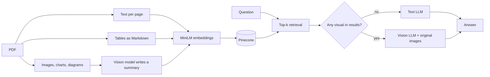

# DocVision RAG 

Most RAG demos treat a PDF as a pile of paragraphs. Real reports aren't like that. The answer to "which quarter had the highest revenue?" is a point on a line chart, and the answer to "where is the critical quality-control point?" is a highlighted box in a diagram. If you only extract text, neither answer is anywhere in your index.

This repo is my attempt at fixing that with the simplest design I could get working. It answers questions about a fictional company report (NovaCore Systems, FY2026) that mixes narrative text, tables, line and bar charts, a pie chart, a product image and a supply-chain diagram.

## The idea

Search with text vectors, answer with the original image.

A vision model writes a short factual description of every image during ingestion. That description is what gets embedded and stored in Pinecone, and the path to the original image rides along in the metadata. At query time, if any of the retrieved chunks is a visual, the real image goes to a vision model together with the text context. If nothing visual comes back, a cheaper text model answers instead.

I picked this over image embeddings (CLIP and friends) because it needs one embedding model, one index and no extra infrastructure. The cost is that retrieval of a chart is only as good as the description of it. More on that under limitations.



## What goes into the index

Every chunk is a LangChain `Document` with the same kind of metadata, so one namespace holds all three types.

| Modality | page_content | Extra metadata |
|---|---|---|
| text | the page's text | `page`, `source` |
| table | the table as a Markdown grid, so rows and columns stay together | `page`, `table_number`, `source` |
| visual | the vision model's summary | `page`, `image_path`, `source` |

For the NovaCore report that comes to 24 documents: 9 text, 8 table and 7 visual.

## Stack

| Piece | Choice |
|---|---|
| PDF extraction | PyMuPDF (text, `find_tables`, embedded images) |
| Embeddings | `sentence-transformers/all-MiniLM-L6-v2`, normalised, 384 dimensions |
| Vector store | Pinecone serverless, cosine similarity |
| Text model | `openai/gpt-oss-20b` on Groq |
| Vision model | `qwen/qwen3.8-27b` on Groq |
| Glue | LangChain |

The model names are the ones I used in my notebook. Groq changes its model list from time to time, so if a call fails with a "model not found" error, check what is currently offered and set `TEXT_MODEL` or `VISION_MODEL` in your `.env`.

## Project layout

```
.
├── main.py                       # CLI: ingest, ask, demo, chat
├── src/multimodal_rag/
│   ├── config.py                 # settings, all overridable from .env
│   ├── ingest.py                 # PDF -> text / table / visual Documents
│   ├── vision.py                 # summarise an image, answer with images
│   ├── vectorstore.py            # embeddings, Pinecone index, upload
│   ├── rag.py                    # retrieve, route, answer
│   └── utils.py                  # image encoding, context formatting
├── notebooks/
│   └── Build_Multimodal_RAG_NovaCore.ipynb   # the original step-by-step version
├── data/
│   └── NovaCore_Multimodal_Company_Report_2026.pdf
├── tests/test_utils.py
├── requirements.txt
└── .env.example
```

The notebook is where I built this first and it's the better place to read the pipeline top to bottom. The `src/` package is the same logic split into modules so you can run it from the command line.

## Setup

You need Python 3.10 or newer, a Groq API key and a Pinecone API key. Both have free tiers.

```bash
git clone https://github.com/Sayanjones/multimodal-pdf-rag.git
cd multimodal-pdf-rag

python -m venv .venv
source .venv/bin/activate        # Windows: .venv\Scripts\activate
pip install -r requirements.txt

cp .env.example .env             # then paste in your two keys
```

## Usage

Ingest the PDF once. This extracts everything, calls the vision model once per unique image, creates the Pinecone index if it doesn't exist, clears the namespace and uploads the documents.

```bash
python main.py ingest
```

Then ask things.

```bash
python main.py ask "Which quarter had the highest revenue?"
python main.py chat              # interactive
python main.py demo              # runs the seven sample questions
```

Each answer prints which route it took (`text` or `vision`), the pages and modalities of the retrieved chunks, and the paths of any images that were sent to the vision model.

To index a different PDF, use `python main.py ingest --pdf path/to/file.pdf`. Be aware that the prompts mention NovaCore by name, so you'll want to adjust them in `vision.py` and `rag.py`.

## Questions to try

The report was written for this kind of testing, so every answer below can be checked by eye. These are the figures in the PDF, not recorded model output.

| Question | Where the answer lives | What the report says |
|---|---|---|
| What was FY2026 revenue? | Page 2 text, page 3 table | $132.0M |
| Which region grew fastest, and which had the best CSAT? | Page 4 table and bar chart | Europe at 31%; Asia Pacific at 4.8/5 |
| Which quarter had the highest revenue? | Page 3 line chart only | Q4 2026, roughly $37.8M |
| Where is the critical quality-control point? | Page 6 diagram | The Quality Lab in Singapore |
| How did support resolution time change? | Page 7 line chart | 14.2 hours in January to 8.1 in August |
| What share of Penang's electricity was solar? | Page 8 pie chart | 34% |

The revenue-peak and quality-lab questions are the interesting ones. Neither answer is stated in a sentence you could retrieve with plain text search.

One thing to watch: numbers read off a chart are estimates. In my notebook run the model put the Q4 2026 peak at about $37.5M, while the chart is closer to $37.8M. The right quarter, a slightly off value. If you need exact figures from a chart, the underlying data has to come from somewhere other than the picture.

## Tests

```bash
pip install -r requirements-dev.txt
pytest
```

The tests cover the helpers (context formatting, picking image paths out of retrieved documents, image encoding, and turning Pinecone's `6.0` page metadata back into `6`). They don't call Groq or Pinecone, so they run offline. Whether the model answers correctly is something I checked by running the demo questions, not something the test suite proves.

## Limitations

Some of these bother me more than others.

- The route decision is crude. If any visual lands in the top 5 results, the question goes to the vision model, even when a table in the same results had the answer. That's fine for a demo and wasteful at scale.
- At most three images are attached per answer, in retrieval order.
- Retrieval quality for visuals depends entirely on the summary. If the vision model skips a number, a question about that number may never surface the chart. Embedding the image directly, or storing several summaries per image, would help.
- Images are de-duplicated by their PDF object id. The facility photo appears on pages 1 and 6 but is stored once, so it carries page 1 in its metadata and an answer may cite the wrong page.
- Only one document, one namespace and one retriever. There's no reranking, no hybrid search and no chunking of long pages.
- Table detection uses PyMuPDF's heuristics. It found all eight tables in this report, but scanned or borderless tables are a different story.
- Ingestion wipes the namespace each time. That keeps re-runs clean and also means you can't keep several documents side by side without changing `PINECONE_NAMESPACE`.


## License

MIT - see [LICENSE](LICENSE). The NovaCore PDF is third-party demo material and isn't covered by it.
